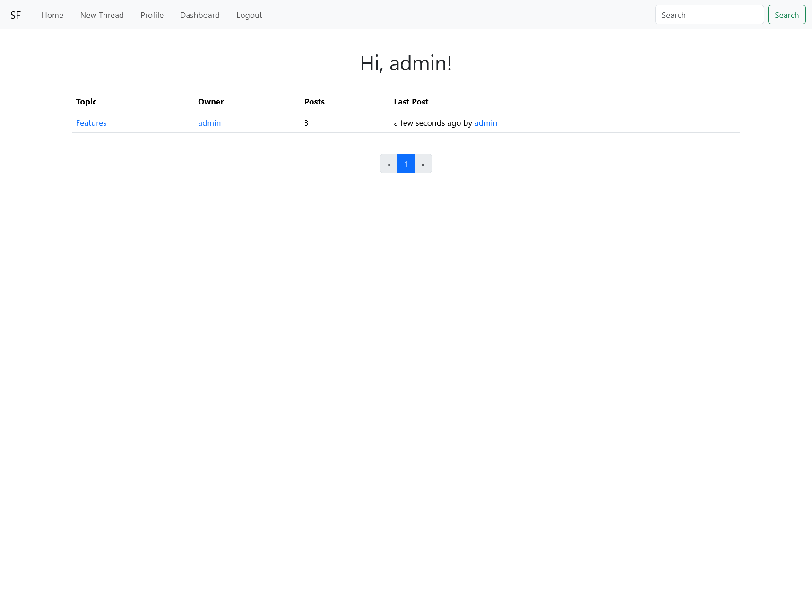
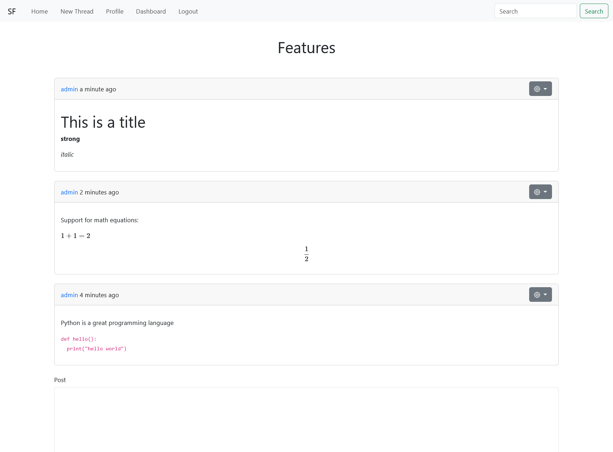

# simple-forum

A simple forum web application build with flask and bootstrap.

Default credentials: ``admin:admin``





## Install requirements

Create a virtual environment and install the requirements:

````shell
python -m venv .venv
pip install -r requirements.txt
````

## Create database

```shell
flask db init
flask db migrate -m "init"
flask db upgrade
```

## Features

- Markdown support
- Create threads
- Create, read, edit, delete and report posts
- Profile page with avatar
- Admin dashboard
- Pagination
